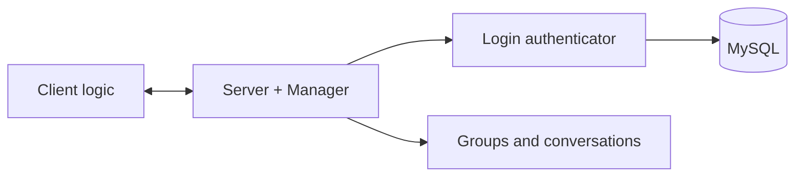

# Socket Chat with MySQL

The second iteration of my Java chat prototype. It keeps the socket-based message flow while adding database-backed login, group metadata, and stored conversations.

## Main pieces

- Java 17 socket server and client logic
- JSON request/response payloads
- MySQL authentication and group data access
- Server-side connection manager and client handlers



## Configuration

Use environment variables instead of putting credentials in source code:

- `CHAT_DB_URL` — defaults to `jdbc:mysql://localhost:3306/chat_app_server_side`
- `CHAT_DB_USER` — defaults to `root`
- `CHAT_DB_PASSWORD` — set when the local database requires one
- `CHAT_USER_PASSWORD` — optional password for the demo client

## Build and run

Requirements: JDK 17, Maven 3.9+, and a local MySQL instance with the expected schema.

```bash
mvn compile
```

Start `Server.Server`, then run the client entry point used for local testing.

## Current state

The core is a backend prototype. Some message operations in `Server.Manager` are unfinished and the database schema/setup scripts still need to be packaged for an easier first run.
