# Chat App — Java Swing, Sockets TCP & PostgreSQL

Application de messagerie desktop développée en **Java** avec **Swing**, basée sur une architecture **client–serveur** utilisant des **sockets TCP** pour les échanges en temps réel et **PostgreSQL** pour la persistance.

L'application permet à plusieurs utilisateurs de se connecter simultanément, de créer des conversations privées ou des groupes, d'échanger des messages en temps réel et de retrouver l'historique des conversations après une nouvelle connexion.

---

## Démonstration

### Vue générale multi-clients

Plusieurs instances du client peuvent être connectées simultanément au même serveur.

<p align="center">
  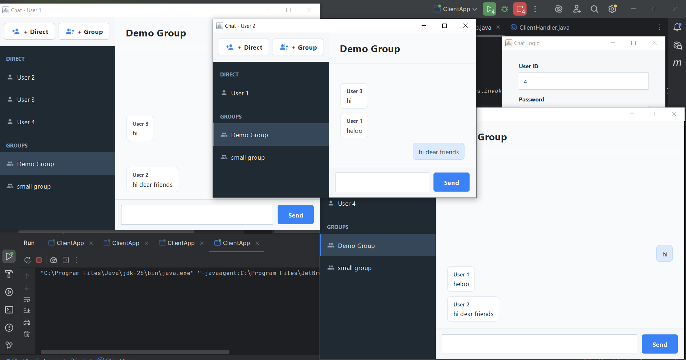
</p>

Chaque fenêtre représente un client indépendant. Le serveur centralise les connexions et transmet les messages aux utilisateurs concernés.

---

### Authentification

Chaque utilisateur se connecte avec son identifiant numérique et son mot de passe.

<p align="center">
  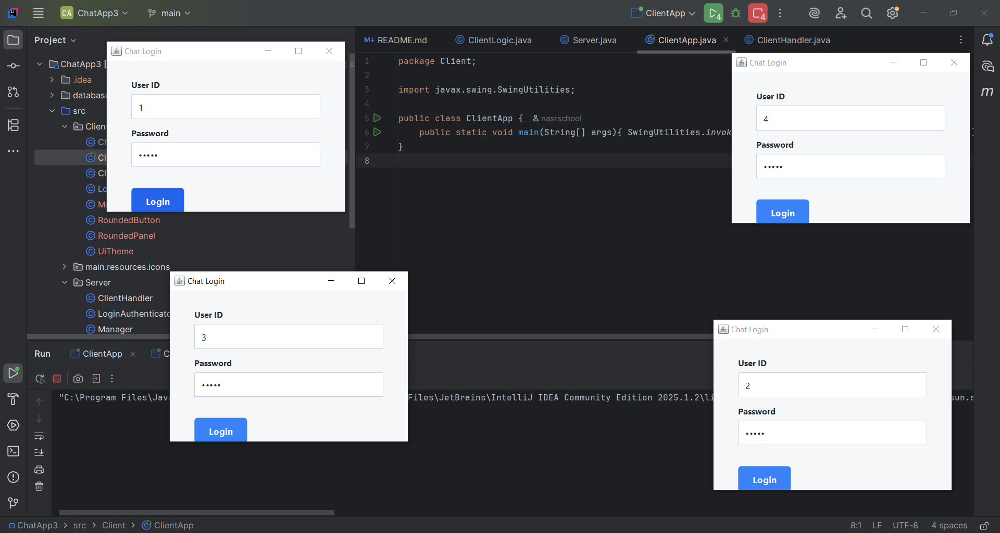
</p>

Le serveur vérifie les informations de connexion avant de créer un `ClientHandler` associé à l'utilisateur connecté.

#### Comptes de démonstration

| Utilisateur | Mot de passe |
|---|---|
| `1` | `demo1` |
| `2` | `demo2` |
| `3` | `demo3` |
| `4` | `demo4` |

Les données initiales contiennent également un groupe **Demo Group** réunissant les quatre utilisateurs. Aucun message ni conversation privée n'est préchargé.

---

### Conversations privées

Un utilisateur peut démarrer une conversation directe avec un autre utilisateur via le bouton **+ Direct**.

<p align="center">
  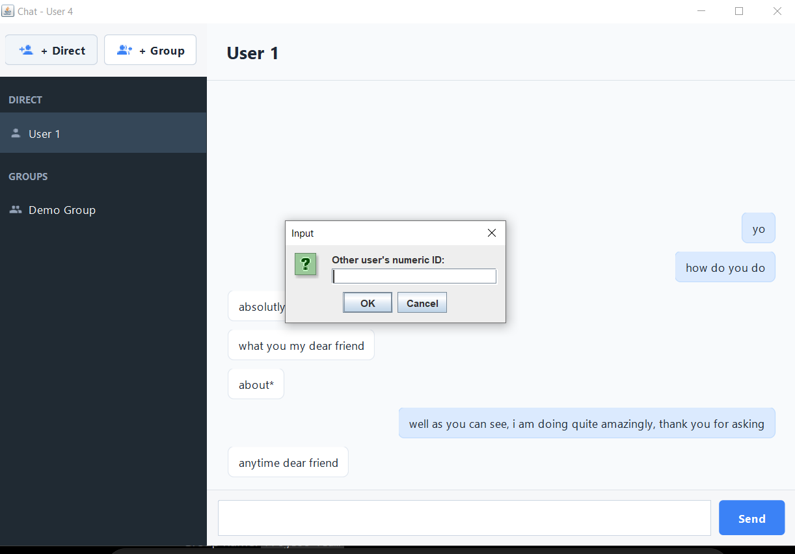
</p>

Une conversation privée est ensuite disponible dans la section **DIRECT**.

#### Deux vues de la même conversation

<table>
  <tr>
    <td width="50%" align="center">
      <strong>Vue de l'utilisateur 1</strong><br><br>
      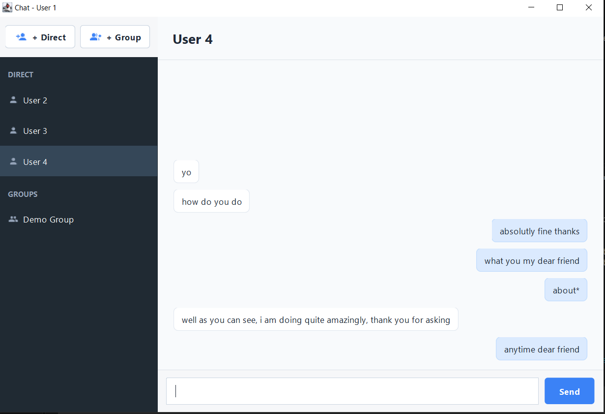
    </td>
    <td width="50%" align="center">
      <strong>Vue de l'utilisateur 4</strong><br><br>
      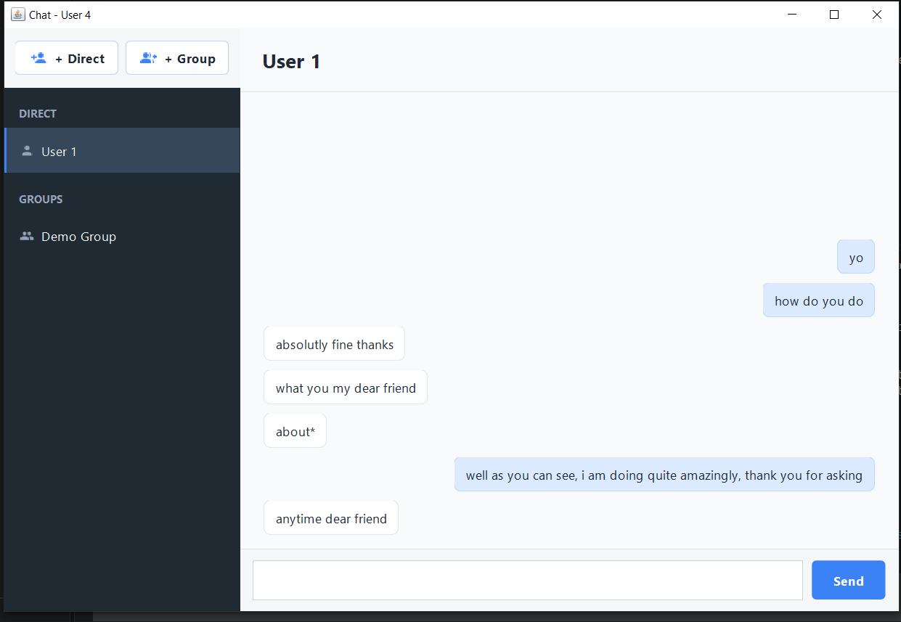
    </td>
  </tr>
</table>

Les messages envoyés par l'utilisateur courant sont affichés à droite, tandis que les messages reçus apparaissent à gauche.

---

### Conversations de groupe

Un utilisateur peut créer une nouvelle conversation de groupe via **+ Group**.

#### Création du groupe

<table>
  <tr>
    <td width="50%" align="center">
      <strong>Étape 1 — Nom du groupe</strong><br><br>
      
    </td>
    <td width="50%" align="center">
      <strong>Étape 2 — Membres du groupe</strong><br><br>
      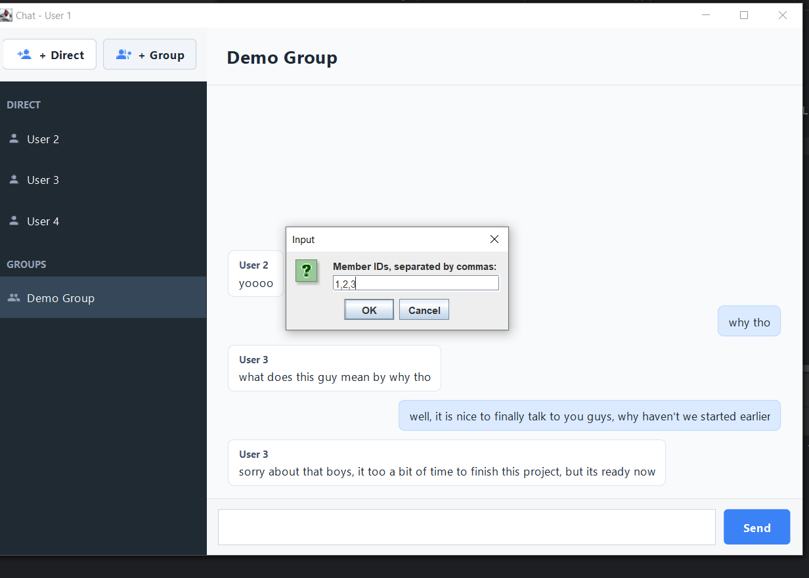
    </td>
  </tr>
</table>

Les identifiants des utilisateurs sont renseignés lors de la création. Une fois le groupe créé, il devient disponible dans la section **GROUPS** des participants concernés.

#### Deux vues de la conversation de groupe

<table>
  <tr>
    <td width="50%" align="center">
      <strong>Vue de l'utilisateur 1</strong><br><br>
      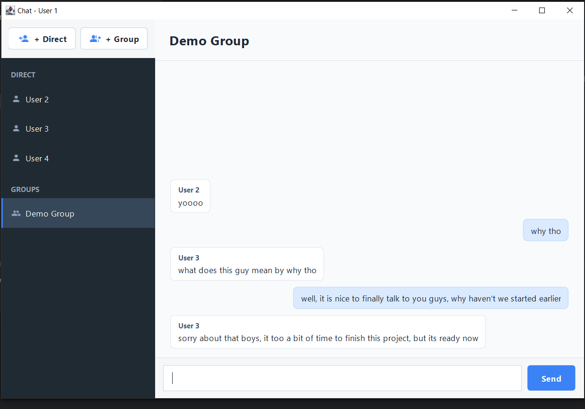
    </td>
    <td width="50%" align="center">
      <strong>Vue de l'utilisateur 4</strong><br><br>
      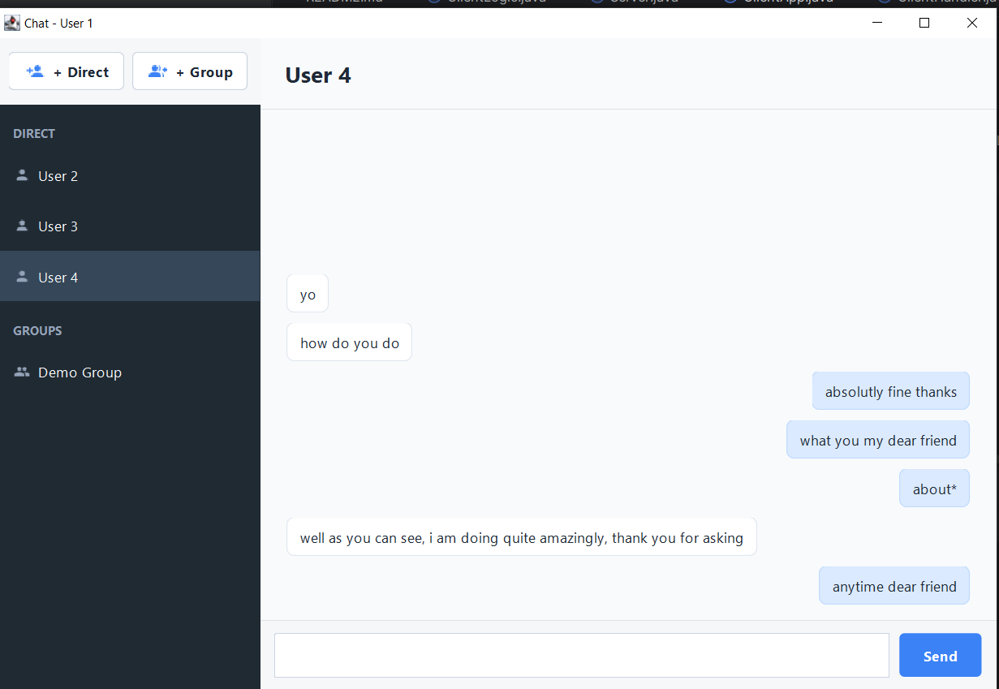
    </td>
  </tr>
</table>

Dans une conversation de groupe, le nom de l'expéditeur est affiché au-dessus des messages reçus.

---

### Démonstration vidéo

La vidéo suivante montre plusieurs clients connectés simultanément et l'échange de messages en temps réel.

[▶ Voir la démonstration vidéo](media/demo/chat-app-demo.mp4)

---

## Fonctionnalités principales

- Authentification des utilisateurs
- Plusieurs clients connectés simultanément
- Conversations privées entre deux utilisateurs
- Création de groupes
- Ajout de plusieurs membres à un groupe
- Messagerie en temps réel via sockets TCP
- Diffusion des messages aux utilisateurs connectés
- Affichage différencié des messages envoyés et reçus
- Affichage de l'expéditeur dans les conversations de groupe
- Historique des messages
- Persistance des conversations dans PostgreSQL
- Possibilité de se reconnecter manuellement après une déconnexion
- Interface graphique développée avec Swing

---

# Fonctionnement technique

## Architecture générale

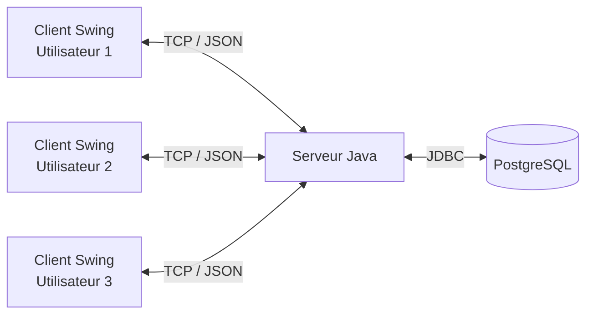

L'application repose sur trois éléments principaux :

1. **Le client Swing**, qui gère l'interface et la communication avec le serveur.
2. **Le serveur Java**, qui centralise les connexions et traite les opérations.
3. **PostgreSQL**, qui stocke les utilisateurs, les groupes et les messages.

---

## Côté client

Le client est responsable de :

- l'écran de connexion ;
- l'affichage des conversations ;
- la création des conversations privées ;
- la création des groupes ;
- l'affichage de l'historique ;
- l'envoi des messages ;
- la réception des messages en temps réel.

La classe `ClientLogic` maintient la connexion socket avec le serveur.

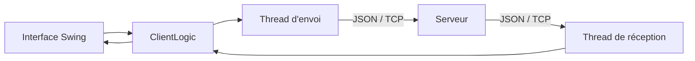

Les messages reçus peuvent donc être traités indépendamment des actions effectuées dans l'interface.

---

## Côté serveur

Le serveur accepte plusieurs connexions simultanément.

Pour chaque utilisateur connecté, un `ClientHandler` est créé.

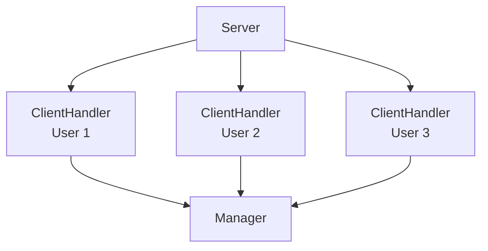

Chaque `ClientHandler` :

- lit les messages envoyés par son client ;
- transmet les réponses du serveur ;
- maintient la connexion ;
- détecte les déconnexions ;
- enregistre et retire l'utilisateur de la liste des clients connectés.

Le `Manager` traite ensuite les opérations métier.

Parmi les principaux types de messages :

- `GET_ALL_GROUP_DATA`
- `GET_ALL_GROUP_CHAT`
- `INVITE_TO_DM`
- `MAKE_GROUP`
- `SEND_MSG`

---

## Authentification

L'authentification est gérée par `LoginAuthenticator`.

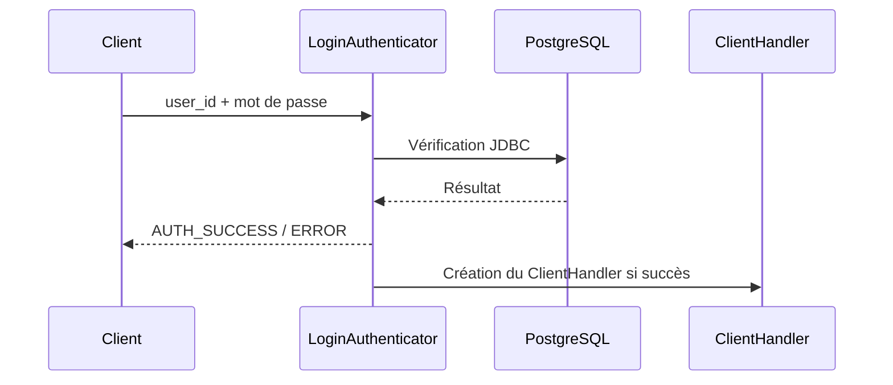

Le serveur vérifie les identifiants dans la base de données et refuse également une nouvelle connexion si l'utilisateur est déjà connecté.

Il n'existe pas de système de session persistante ni de reconnexion automatique : après une déconnexion, l'utilisateur peut simplement se connecter à nouveau.

---

## Conversations privées

Une conversation directe n'utilise pas un modèle séparé.

Elle est représentée par un groupe contenant exactement deux membres avec :

```text
is_private = true
```

Cette approche permet de réutiliser la même logique pour :

- les membres ;
- les messages ;
- l'historique ;
- la persistance ;
- la diffusion en temps réel.

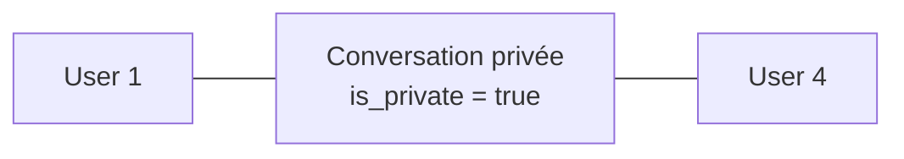

Avant de créer une nouvelle conversation privée, le serveur vérifie qu'une conversation contenant exactement ces deux utilisateurs n'existe pas déjà.

---

## Création d'un groupe

Lorsqu'un utilisateur crée un groupe, le client envoie une requête `MAKE_GROUP`.

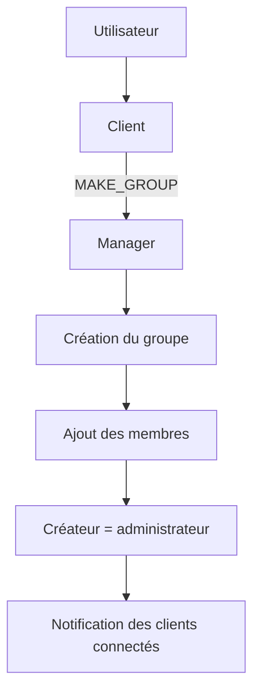

Le serveur :

1. crée le groupe ;
2. ajoute le créateur ;
3. ajoute les membres sélectionnés ;
4. enregistre le créateur comme administrateur ;
5. notifie les utilisateurs connectés afin que leur liste de conversations soit actualisée.

---

## Flux d'un message

Le flux principal d'un message est le suivant :

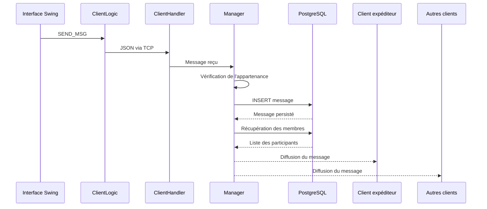

Le serveur renvoie donc le message au **client expéditeur lui-même** ainsi qu'aux autres membres connectés.

C'est ce retour serveur qui permet au client expéditeur d'afficher son propre message : l'interface n'insère pas le message de manière optimiste avant réception de la diffusion serveur.

---

## Historique et persistance

Les messages sont stockés dans PostgreSQL.

Lorsqu'un utilisateur ouvre une conversation, le client demande son historique au serveur via `GET_ALL_GROUP_CHAT`.

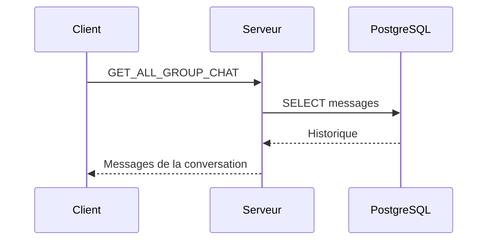

L'historique reste donc disponible après une déconnexion ou un redémarrage du client.

---

## Modèle de données

Les principales tables sont :

### `users_table`

Contient les utilisateurs et leurs informations d'authentification.

### `users_of_groups`

Associe les utilisateurs aux conversations.

Elle contient notamment :

- `group_id`
- `user_id`
- `is_private`
- `group_name`

### `admins_of_groups`

Stocke les administrateurs des groupes.

### `groups_chats`

Stocke les messages des conversations avec notamment :

- l'identifiant de la conversation ;
- l'expéditeur ;
- le contenu ;
- la date du message.

---

## Technologies utilisées

| Domaine | Technologie |
|---|---|
| Langage | Java |
| Interface graphique | Swing / AWT |
| Communication réseau | TCP Sockets |
| Format des échanges | JSON |
| Concurrence | Threads Java |
| Base de données | PostgreSQL |
| Accès aux données | JDBC |
| Build | Maven |
| Conteneurisation de la base | Docker / Docker Compose |

---

## Structure du projet

```text
.
├── docker-compose.yml
├── pom.xml
├── README.md
├── database/
│   ├── schema.sql
│   └── sample_data.sql
├── media/
│   ├── screenshots/
│   └── demo/
└── src/
    ├── Client/
    │   ├── ClientApp.java
    │   ├── ClientLogic.java
    │   ├── LoginFrame.java
    │   ├── ChatFrame.java
    │   ├── UiTheme.java
    │   ├── RoundedButton.java
    │   ├── RoundedPanel.java
    │   └── ModernScrollBarUI.java
    ├── Server/
    │   ├── Server.java
    │   ├── ClientHandler.java
    │   ├── LoginAuthenticator.java
    │   └── Manager.java
    ├── Tools/
    │   ├── DataToJson.java
    │   ├── MsgTypes.java
    │   └── Statements.java
    └── main/
        └── resources/
            └── icons/
                ├── *.png
                └── LICENSE
```

Les icônes utilisées par l'interface sont embarquées dans les ressources du projet avec leur licence.

---

# Exécution locale

## Prérequis

- Java 17 ou supérieur
- Maven
- Docker
- Docker Compose

---

## Configuration par défaut

Le serveur utilise les valeurs suivantes par défaut :

```text
URL JDBC : jdbc:postgresql://localhost:5432/chat_app_server_side
Utilisateur : chatuser
Mot de passe : chatpass
```

Le client se connecte par défaut au serveur sur l'hôte local.

---

## Variables de configuration

Les valeurs par défaut peuvent être remplacées par des variables d'environnement.

### Base de données

```text
CHAT_DB_PORT
CHAT_DB_URL
CHAT_DB_USER
CHAT_DB_PASSWORD
```

Exemple PowerShell :

```powershell
$env:CHAT_DB_PORT="5433"
$env:CHAT_DB_URL="jdbc:postgresql://localhost:5433/chat_app_server_side"
$env:CHAT_DB_USER="chatuser"
$env:CHAT_DB_PASSWORD="chatpass"
```

### Serveur de chat

Pour connecter le client à une autre machine :

```text
CHAT_SERVER_HOST
```

Exemple :

```powershell
$env:CHAT_SERVER_HOST="192.168.1.10"
```

---

## 1. Démarrer PostgreSQL

Depuis la racine du projet :

```bash
docker compose up -d
```

Vérifier que le conteneur fonctionne :

```bash
docker compose ps
```

---

## Port PostgreSQL déjà utilisé

Si le port `5432` est déjà occupé par une installation locale de PostgreSQL ou un autre conteneur, utiliser un autre port pour le conteneur.

Par exemple, exposer PostgreSQL sur `5433`, puis lancer l'application avec :

```powershell
$env:CHAT_DB_PORT="5433"
$env:CHAT_DB_URL="jdbc:postgresql://localhost:5433/chat_app_server_side"
```

Le port configuré dans `docker-compose.yml` et celui utilisé dans l'URL JDBC doivent correspondre.

---

## Gestion des données Docker

Arrêter les conteneurs sans supprimer les données :

```bash
docker compose down
```

Le volume PostgreSQL est conservé. Les utilisateurs, groupes et messages déjà enregistrés restent disponibles au prochain démarrage.

Pour supprimer également le volume et recréer complètement la base :

```bash
docker compose down -v
docker compose up -d
```

Cette commande supprime les données persistées et relance l'initialisation de la base à partir des scripts SQL.

---

## 2. Compiler l'application

```bash
mvn clean compile
```

---

## 3. Démarrer le serveur

```bash
mvn exec:java -Dexec.mainClass="Server.Server"
```

Le serveur doit être lancé avant les clients.

---

## 4. Démarrer un client

Dans un autre terminal :

```bash
mvn exec:java -Dexec.mainClass="Client.ClientApp"
```

La même commande peut être exécutée plusieurs fois afin de lancer plusieurs utilisateurs simultanément.

---

## 5. Se connecter avec les comptes de démonstration

| Utilisateur | Mot de passe |
|---|---|
| `1` | `demo1` |
| `2` | `demo2` |
| `3` | `demo3` |
| `4` | `demo4` |

Les quatre utilisateurs appartiennent initialement au groupe **Demo Group**.

Il n'y a pas de messages ni de conversation privée préchargés dans les données initiales.

---

## 6. Tester la messagerie

Une fois plusieurs clients connectés :

- créer une conversation directe ;
- envoyer des messages entre deux utilisateurs ;
- créer un groupe ;
- ajouter plusieurs membres ;
- envoyer des messages depuis plusieurs clients ;
- fermer puis rouvrir un client ;
- se connecter à nouveau ;
- ouvrir une conversation pour vérifier que l'historique a été persisté.

---

# Résumé

Ce projet met en œuvre une architecture client–serveur en Java avec :

- une interface graphique Swing ;
- des connexions TCP persistantes ;
- plusieurs clients simultanés ;
- une gestion des conversations privées et des groupes ;
- des messages JSON ;
- une base PostgreSQL ;
- la persistance de l'historique ;
- la diffusion des messages en temps réel ;
- une configuration locale simple via Docker Compose.

L'objectif est de proposer une implémentation claire et lisible d'une application de messagerie temps réel sans framework réseau externe.
